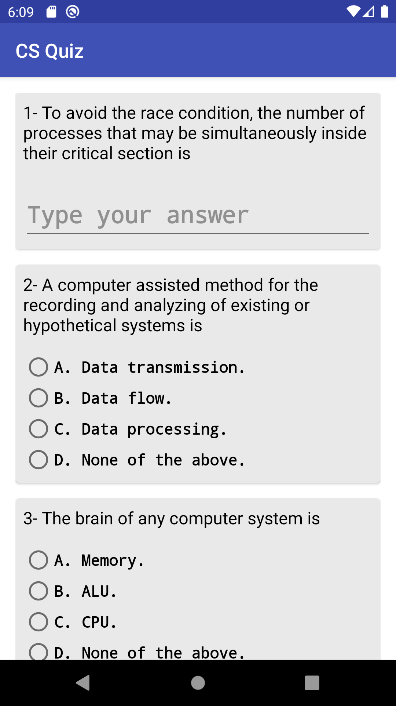
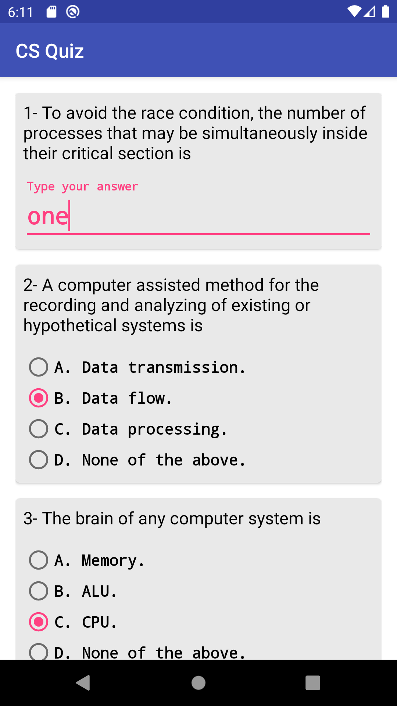
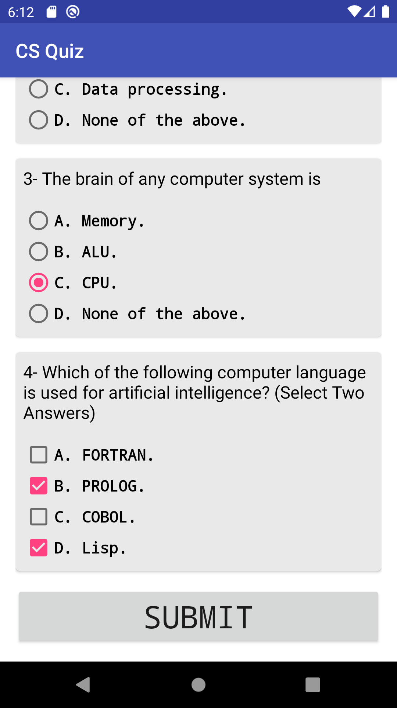
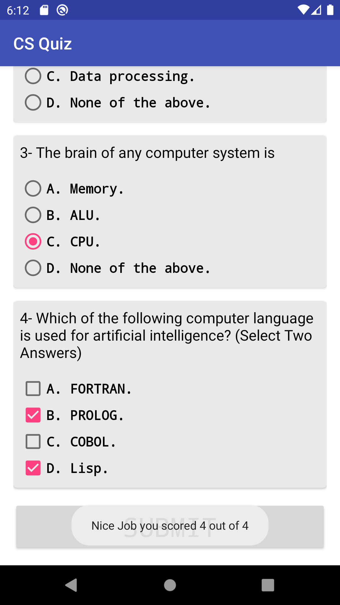

# Quiz-App-ABND-P3
Project #3 in Android Basics Nanodegree by Google

<h2>Project Requirements:</h2>

 Design and implement a short quiz app about some topic you are familiar with.

<h3>Screenshot #1</h3>

<h3>Screenshot #2</h3>

<h3>Screenshot #3</h3>
/>

<h3>Screenshot #4</h3>

